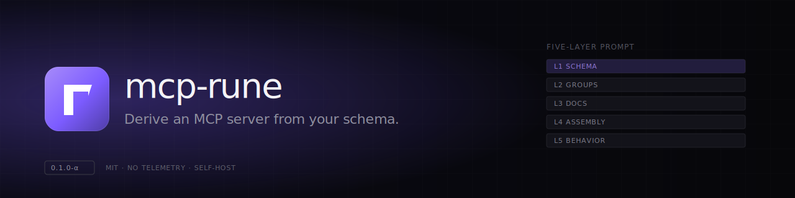

<p align="center">
  
</p>

<p align="center">
  <a href="https://github.com/mcp-rune/mcp-rune/actions/workflows/ci.yml"></a>
  
  
  
  
  
</p>

# mcp-rune

**Batteries-included MCP framework.** Define models, get CRUD tools, prompt strategies, interactive apps, OAuth, and docs — the Rails of MCP servers.

mcp-rune is an opinionated, model-driven framework for building [Model Context Protocol](https://modelcontextprotocol.io/) servers. Like Rails was extracted from Basecamp, mcp-rune was extracted from production MCP servers that power real workflows daily.

```typescript
import { BaseModel } from '@mcp-rune/mcp-rune/core'
import type { AttributeDefinition } from '@mcp-rune/mcp-rune/core'

export class Book extends BaseModel {
  static override endpoint = 'books'
  static override attributes: Record<string, AttributeDefinition> = {
    title: { type: 'string', required: true, description: 'Book title' },
    author: { type: 'string', required: true, description: 'Author name' },
    status: { type: 'enum', enumValues: ['unread', 'reading', 'completed'], default: 'unread' },
    rating: { type: 'integer', description: 'Rating 1-5', validation: { min: 1, max: 5 } }
  }
}

// That's it. You now have:
//   list_models, find_records, create_model, update_model, delete_model,
//   search_records, get_filters_guide, bulk_action_models
//   + compound IDs for nested resources (titles/42/assets/7)
//   + prompt guide with validation strategy
//   + interactive form, list, picker, and detail apps
//   + auto-generated documentation
//
// All tools are polymorphic — they work with every model you register.
// 10 models, still 8 tools. The LLM's context stays clean.
```

<details>
<summary>JavaScript version</summary>

```javascript
import { BaseModel } from '@mcp-rune/mcp-rune/core'

export class Book extends BaseModel {
  static api = { endpoint: 'books' }
  static attributes = {
    title: { type: 'string', required: true, description: 'Book title' },
    author: { type: 'string', required: true, description: 'Author name' },
    status: { type: 'enum', enumValues: ['unread', 'reading', 'completed'], default: 'unread' },
    rating: { type: 'integer', description: 'Rating 1-5', validation: { min: 1, max: 5 } }
  }
}
```

</details>

---

## Why "mcp-rune"?

A rune is a compact, declarative symbol that produces powerful effects far larger than itself. In mcp-rune, **everything you write is a rune**.

You inscribe declarations:

- a **model** — what your domain looks like
- a **prompt** — how the LLM should reason about it
- an **app** — how humans interact with it
- a **workflow** — how operations chain together

Each inscription fits on one screen. The framework is the runic system: an alphabet of conventions (`BaseModel`, `BasePrompt`, `AppRegistry`, `DomainRegistry`) and a casting engine that turns those inscriptions into a complete MCP server — tools, validation pipelines, UI, OAuth, observability, documentation.

The model is the foundational rune — prompts and apps derive their structure from it (the framework's single source of truth). But each kind of inscription adds its own dimension: prompts add reasoning, apps add interaction, workflows add orchestration.

_Inscribe small. Cast large._

---

## Table of Contents

- [Why "mcp-rune"?](#why-mcp-rune)
- [Why use mcp-rune?](#why-use-mcp-rune)
- [Features](#features)
  - [Polymorphic CRUD Tools](#polymorphic-crud-tools)
  - [Prompt Strategies](#prompt-strategies)
  - [API-Agnostic Integration](#api-agnostic-integration)
  - [Interactive MCP Apps](#interactive-mcp-apps)
  - [Analysis & Summary Strategies](#analysis--summary-strategies)
  - [Domain Intelligence](#domain-intelligence)
  - [Extensibility](#extensibility)
  - [OAuth 2.1 + PKCE](#oauth-21--pkce)
  - [Dual Transport](#dual-transport)
  - [Observability](#observability)
- [Quick Start](#quick-start)
- [Database](#database)
- [Subpath Imports](#subpath-imports)
- [Architecture](#architecture)
- [Documentation](#documentation)
- [Design Principles](#design-principles)
- [Comparison with Alternatives](#comparison-with-alternatives)
- [Development](#development)
- [Tech Stack](#tech-stack)
- [Contributing](#contributing)
- [License](#license)

---

## Why use mcp-rune?

Every MCP framework today works at the **transport/tool** level. You register tools, handle HTTP, write one handler per operation per model. 10 models x 5 CRUD operations = 50 hand-written tool handlers. Tool lists bloat, LLM tool selection degrades, and you're maintaining boilerplate across every model.

mcp-rune works at the **application** level. You describe your domain, the framework builds the MCP surface:

```
  You write                         mcp-rune generates
 ┌──────────────────┐     ┌────────────────────────────────────────┐
 │  Model           │────▶│  Polymorphic CRUD tools (8 tools       │
 │  attributesConfig│     │    serve ALL models, not N x 5)        │
 └──────────────────┘     ├────────────────────────────────────────┤
 ┌──────────────────┐     │  Prompt guide with validation          │
 │  Prompt          │────▶│    (stateless / hybrid / stateful)     │
 │  fieldGroups     │     ├────────────────────────────────────────┤
 │  sections        │     │  Interactive Apps (form, list,         │
 └──────────────────┘     │    detail, search, autocomplete)       │
                          ├────────────────────────────────────────┤
                          │  Field documentation & reference       │
                          │    tables (auto-generated from config) │
                          └────────────────────────────────────────┘
```

### How It Compares

|                                        | Protocol Wrappers | API Converters | **mcp-rune** |
| -------------------------------------- | :---------------: | :------------: | :----------: |
| Transport (stdio + HTTP)               |        ✅         |       ✅       |      ✅      |
| Tool registration & schema             |        ✅         |       ✅       |      ✅      |
| OAuth 2.1 + PKCE                       |        ⚠️         |       ❌       |      ✅      |
| Polymorphic CRUD from model config     |        ❌         |       ⚠️       |      ✅      |
| Bulk operations (batch CRUD)           |        ❌         |       ❌       |      ✅      |
| API convention abstraction             |        ❌         |       ❌       |      ✅      |
| Prompt strategies (form validation)    |        ❌         |       ❌       |      ✅      |
| Schema-driven interactive Apps         |        ⚠️         |       ❌       |      ✅      |
| Search adapters                        |        ❌         |       ❌       |      ✅      |
| Domain workflows & business rules      |        ❌         |       ❌       |      ✅      |
| Analysis & GraphRAG summary strategies |        ❌         |       ❌       |      ✅      |
| Documentation generation pipeline      |        ❌         |       ❌       |      ✅      |

---

## Features

### Polymorphic CRUD Tools

8 generic tools serve your entire domain. Register 10 models or 100 — the tool count stays constant:

| Tool                 | Description                                |
| -------------------- | ------------------------------------------ |
| `list_models`        | List available model schemas               |
| `find_records`       | Fetch by ID, list nested via `parent_path` |
| `create_model`       | Create with attribute validation           |
| `update_model`       | Partial update                             |
| `delete_model`       | Destroy a record                           |
| `search_records`     | Full-text and filtered search              |
| `get_filters_guide`  | Describe available filters for a model     |
| `bulk_action_models` | Batch create/update/delete                 |

Nested resources use **compound IDs** (`titles/42/assets/7`) — no separate nested tools needed. The LLM passes the model name as a parameter — `{ "model": "book", "attributes": {...} }`. Fewer tools = better LLM tool selection, smaller system prompts, more context window for actual work.

Tools declare a **category** and the framework infers auth requirements automatically:

```typescript
import { BaseTool, TOOL_CATEGORIES } from '@mcp-rune/mcp-rune'

export class ArchiveProjectTool extends BaseTool {
  static override get category() {
    return TOOL_CATEGORIES.CUSTOM
  }

  override get name() {
    return 'archive_project'
  }

  override async execute({ project_id }: { project_id: string }) {
    return this.apiClient!.post(`/projects/${project_id}/archive`)
  }
}
```

<details>
<summary>JavaScript version</summary>

```javascript
import { BaseTool, TOOL_CATEGORIES } from '@mcp-rune/mcp-rune'

export class ArchiveProjectTool extends BaseTool {
  static get category() {
    return TOOL_CATEGORIES.CUSTOM
  }

  get name() {
    return 'archive_project'
  }

  async execute({ project_id }) {
    return this.apiClient.post(`/projects/${project_id}/archive`)
  }
}
```

</details>

| Category       | Auth | Description                                            |
| -------------- | :--: | ------------------------------------------------------ |
| `DATA`         | Yes  | CRUD, bulk, search, and discovery on models            |
| `STRATEGY`     |  No  | Prompt guidance & form validation                      |
| `AUTOCOMPLETE` | Yes  | Field value suggestions from API                       |
| `ANALYSIS`     |  No  | Qualitative data analysis sessions (vector storage)    |
| `OPERATIONS`   |  No  | Retrospective CRUD operation analysis (vector storage) |
| `DOMAIN`       |  No  | Domain intelligence (knowledge, rules, workflows)      |
| `CUSTOM`       |  --  | Server-specific (you decide)                           |

### Prompt Strategies

How does an LLM correctly fill out a 25-field form? Most MCP servers don't try. mcp-rune provides three strategies that adapt validation UX to form complexity:

| Strategy      | Fields | Operations                                              | Use Case      |
| ------------- | ------ | ------------------------------------------------------- | ------------- |
| **Stateless** | < 10   | `getDocumentation`                                      | Simple forms  |
| **Hybrid**    | 10-20  | `getDocumentation`, `validateFields`, `generateSummary` | Medium forms  |
| **Stateful**  | 20+    | All above + `validateSection`, `getProgress`            | Complex forms |

```typescript
import { BasePrompt, derivePromptSchema, PromptContentGenerator } from '@mcp-rune/mcp-rune/prompts'
import type { PromptContent } from '@mcp-rune/mcp-rune/prompts'
import { Book } from '../models/book.js'

export class BookPrompt extends BasePrompt {
  static override strategy = 'hybrid' as const

  static override fieldGroups = {
    identity: { fields: ['title', 'author'], context: 'Book Identity', required: true },
    status: { fields: ['status', 'rating'], context: 'Reading Status' }
  }

  // Schema derived FROM model — model is the single source of truth
  static {
    const schema = derivePromptSchema(Book, { fieldGroups: this.fieldGroups })
    this.fieldGroups = schema.fieldGroups
    this.fieldDefinitions = schema.fieldDefinitions
  }

  override get promptContent(): PromptContent[] {
    return PromptContentGenerator.for(BookPrompt, 'book')
      .add('# Book Creation Guide\n\nCreate a new book in the library.')
      .standard() // flowDiagram → guidance → allSections → summary
      .toolUsage() // auto-generated from static config
      .attributeReference() // auto-generated field reference table
      .build()
  }
}
```

<details>
<summary>JavaScript version</summary>

```javascript
import { BasePrompt, derivePromptSchema, PromptContentGenerator } from '@mcp-rune/mcp-rune/prompts'
import { Book } from '../models/book.js'

export class BookPrompt extends BasePrompt {
  static strategy = 'hybrid'

  static fieldGroups = {
    identity: { fields: ['title', 'author'], context: 'Book Identity', required: true },
    status: { fields: ['status', 'rating'], context: 'Reading Status' }
  }

  static {
    const schema = derivePromptSchema(Book, { fieldGroups: this.fieldGroups })
    this.fieldGroups = schema.fieldGroups
    this.fieldDefinitions = schema.fieldDefinitions
  }

  get promptContent() {
    return PromptContentGenerator.for(BookPrompt, 'book')
      .add('# Book Creation Guide\n\nCreate a new book in the library.')
      .standard()
      .toolUsage()
      .attributeReference()
      .build()
  }
}
```

</details>

The `PromptContentGenerator` pipeline assembles documentation from your model config — field tables, enum options, validation rules, workflow diagrams. Change the model, the docs update automatically.

### API-Agnostic Integration

mcp-rune connects to any REST API through pluggable **API conventions**:

| Convention   | `belongsTo`               | `hasMany`          |
| ------------ | ------------------------- | ------------------ |
| **HAL**      | `{rel}_link` + `{rel}_id` | `{singular}_ids[]` |
| **JSON:API** | `{rel}_id`                | `{singular}_ids[]` |

The convention handles payload wrapping, association resolution, and response normalization. Need a different API style? Implement a convention — the rest of the framework adapts.

**The service layer** (`ModelService` + `EndpointResolver`) sits between tools and the API client, providing a layered endpoint resolution chain inspired by Ember Data's Adapter pattern:

```
Per-action override → Collection override → Parent path → Namespace → Base endpoint
```

Configure per-model namespaces, per-action endpoint overrides, or subclass `EndpointResolver` for full URL control — without changing model definitions or tool code.

**Search adapters** bridge mcp-rune's generic filter format to whatever the backend expects:

```typescript
import { SearchAdapter } from '@mcp-rune/mcp-rune/search'

export class ActivitySearchAdapter extends SearchAdapter {
  override buildBody(query: string | null, filters?: Record<string, unknown>) {
    const body = super.buildBody(query, filters) as Record<string, unknown>

    // Transform: { duration_minutes: { from: 40, to: 120 } }
    //        →   { min_duration: 40, max_duration: 120 }
    const duration = filters?.duration_minutes as { from?: number; to?: number } | undefined
    if (duration) {
      body.min_duration = duration.from
      body.max_duration = duration.to
      delete (body.filters as Record<string, unknown>)?.duration_minutes
    }

    return body
  }
}
```

<details>
<summary>JavaScript version</summary>

```javascript
import { SearchAdapter } from '@mcp-rune/mcp-rune/search'

export class ActivitySearchAdapter extends SearchAdapter {
  buildBody(query, filters) {
    const body = super.buildBody(query, filters)

    // Transform: { duration_minutes: { from: 40, to: 120 } }
    //        →   { min_duration: 40, max_duration: 120 }
    const duration = filters?.duration_minutes
    if (duration) {
      body.min_duration = duration.from
      body.max_duration = duration.to
      delete body.filters?.duration_minutes
    }

    return body
  }
}
```

</details>

### Interactive MCP Apps

Seven schema-driven app tools render interactive UI in the MCP host (Claude Desktop, VS Code, Cursor) via [`@modelcontextprotocol/ext-apps`](https://github.com/anthropics/anthropic-cookbook/tree/main/misc/model-context-protocol-apps):

| Tool                       | Description                                          |
| -------------------------- | ---------------------------------------------------- |
| **`new_model_app`**        | Form to input a new record (calls `create_model`)    |
| **`edit_model_app`**       | Form to edit a record (calls `update_model`)         |
| **`find_model_app`**       | Interactive table — text search + structured filters |
| **`show_model_app`**       | Read-only detail cards                               |
| **`view_selection_app`**   | Inspect and manage the current record selection      |
| **`pick_model_app`**       | Type-ahead for `belongsTo` associations              |
| **`multi_pick_model_app`** | Checkbox picker for `hasMany` relations              |

Generated from the same `attributesConfig` that drives the tools and prompts. Adding a new model form = one registry entry, zero new HTML. This turns your MCP server from a tool collection into a full application with UI.

### Analysis & Summary Strategies

Most MCP servers stop at CRUD. mcp-rune ships a map-reduce analysis layer that lets the LLM ingest large datasets (thousands of records), summarize them along multiple dimensions, store findings as semantic memories, and act on them — all without burning context window on raw rows.

Enable with `ANALYSIS_ENABLED=true` and a `DATABASE_URL`. Six tools then become available alongside the polymorphic CRUD set:

| Tool                 | Description                                                        |
| -------------------- | ------------------------------------------------------------------ |
| `analysis_ingest`    | Stage a dataset (1h TTL) for downstream summarization and querying |
| `analysis_summarize` | Run one or more summary strategies over the staged data            |
| `analysis_query`     | Semantic search across stored findings (384-dim embeddings)        |
| `analysis_store`     | Persist a finding as an ephemeral (1h) or long-lived memory        |
| `analysis_act`       | Apply a stored finding back as a CRUD operation                    |
| `analysis_clear`     | Drop the ingested dataset and any ephemeral findings               |

**Nine composable summary strategies**, in two families:

| Family      | Strategies                                                                        |
| ----------- | --------------------------------------------------------------------------------- |
| Field-level | `distribution` · `coverage` · `anomaly` · `temporal` · `entity-extraction`        |
| GraphRAG    | `concept-touch` · `relationship-coverage` · `semantic-cluster` · `rule-violation` |

Each is documented in its own [per-strategy guide](docs/guides/summary-strategies/) with input shape, algorithm, and output schema. Strategies can be **stratified** before they run (by concept, edge type, or cluster) so a single ingest yields multiple slice-aware summaries in one pass.

The GraphRAG family builds on the framework's relationship-aware storage: records carry embeddings, ingestion follows declared edges (multi-hop), and `relationship-coverage` reports per-edge-type completeness so you can spot dangling references before they reach the LLM.

See [Analysis Memories](docs/guides/analysis-memories-guide.md) for the session lifecycle, [Analysis Quickstart](docs/guides/analysis-quickstart-guide.md) for an end-to-end walkthrough, and [Summary Strategies](docs/guides/summary-strategies.md) for the strategy index.

### Domain Intelligence

Encode business knowledge, rules, and operational workflows that guide the LLM:

```typescript
import { WorkflowDefinition } from '@mcp-rune/mcp-rune/domain'

export const onboardNewUser = new WorkflowDefinition({
  name: 'onboard_new_user',
  description: 'Complete onboarding for a new team member',
  steps: [
    { name: 'create_user', tool: 'create_model', model: 'user' },
    {
      name: 'assign_role',
      tool: 'update_model',
      model: 'user',
      description: 'Set the role based on department'
    },
    {
      name: 'send_welcome',
      tool: 'send_notification',
      description: 'Trigger the welcome email sequence'
    }
  ],
  tips: ['Always check existing users before creating duplicates']
})
```

<details>
<summary>JavaScript version</summary>

```javascript
import { WorkflowDefinition } from '@mcp-rune/mcp-rune/domain'

export const onboardNewUser = new WorkflowDefinition({
  name: 'onboard_new_user',
  description: 'Complete onboarding for a new team member',
  steps: [
    { name: 'create_user', tool: 'create_model', model: 'user' },
    {
      name: 'assign_role',
      tool: 'update_model',
      model: 'user',
      description: 'Set the role based on department'
    },
    {
      name: 'send_welcome',
      tool: 'send_notification',
      description: 'Trigger the welcome email sequence'
    }
  ],
  tips: ['Always check existing users before creating duplicates']
})
```

</details>

### Extensibility

Every framework-shipped surface is a default, not a wall. Three extension protocols let you add behavior without forking:

| Extension           | What it extends                                            | Typical use                                         |
| ------------------- | ---------------------------------------------------------- | --------------------------------------------------- |
| `HttpExtension`     | Routes mounted on `HttpServer` (auth-aware, order-defined) | Webhooks, health probes, custom OAuth endpoints     |
| `ApiExtension`      | Per-model config bag consumed by tools                     | Per-model bulk actions, custom autocomplete sources |
| `ToolFlowExtension` | Context threaded into tool handlers                        | Approval flows, multi-step LLM ↔ user handoffs      |

mcp-rune never auto-registers an extension — every surface is opt-in at the call site. See [Extensibility Overview](docs/guides/extensibility-overview.md) for the architecture, [Extension Recipes](docs/guides/extension-recipes.md) for ready-to-paste patterns, and [Authoring Extensions](docs/guides/authoring-extensions-guide.md) for the contract a custom extension must satisfy.

### OAuth 2.1 + PKCE

Production-grade OAuth2 built on [openid-client](https://github.com/panva/openid-client):

```
┌──────────────────────────────────────────────────────────────┬──────────────┐
│                     RFC / Specification                      │    Status    │
├──────────────────────────────────────────────────────────────┼──────────────┤
│ RFC 9728 — Protected Resource Metadata*                      │              │
│   • Origin-only form (/.well-known/oauth-protected-resource) │ Implemented  │
│   • §3.1 path-inserted form                                  │ Implemented  │
│   • WWW-Authenticate resource_metadata parameter             │ Implemented  │
├──────────────────────────────────────────────────────────────┼──────────────┤
│ RFC 8414 — Authorization Server Metadata Discovery           │              │
│   • Metadata proxy with endpoint rewriting                   │ Implemented  │
│   • OpenID Configuration alias                               │ Implemented  │
├──────────────────────────────────────────────────────────────┼──────────────┤
│ RFC 7591 — Dynamic Client Registration (DCR)                 │              │
│   • Registration proxy with fallback to pre-configured       │ Implemented  │
├──────────────────────────────────────────────────────────────┼──────────────┤
│ CIMD — Client ID Metadata Document (IETF Draft)              │              │
│   • draft-ietf-oauth-client-id-metadata-document             │              │
│   • Metadata endpoint at /oauth/client-metadata.json         │ Implemented  │
├──────────────────────────────────────────────────────────────┼──────────────┤
│ RFC 6749 — OAuth 2.0 Authorization Framework                 │              │
│   • Authorization Code Grant (with mandatory PKCE)           │ Implemented  │
│   • Client Credentials Grant (M2M)                           │ Implemented  │
│   • Refresh Token Grant (auto-refresh with 5 min buffer)     │ Implemented  │
├──────────────────────────────────────────────────────────────┼──────────────┤
│ RFC 7636 — Proof Key for Code Exchange (PKCE)                │              │
│   • S256 challenge method (mandatory for all flows)          │ Implemented  │
├──────────────────────────────────────────────────────────────┼──────────────┤
│ RFC 7662 — Token Introspection                               │              │
│   • Cached introspection (60s TTL, 100-entry LRU)            │ Implemented  │
├──────────────────────────────────────────────────────────────┼──────────────┤
│ RFC 8707 — Resource Indicators                               │              │
│   • Audience-restricted tokens via resource parameter        │ Implemented  │
├──────────────────────────────────────────────────────────────┼──────────────┤
│ Token Revocation                                             │ Implemented  │
├──────────────────────────────────────────────────────────────┼──────────────┤
│ OpenID Connect Core 1.0                                      │              │
│   • Discovery via openid-client                              │ Implemented  │
│   • UserInfo endpoint (fallback to introspection)            │ Implemented  │
└──────────────────────────────────────────────────────────────┴──────────────┘
```

> \* In path-prefixed deployments (`HttpServer` constructed with a non-empty `pathPrefix`), the framework delegates the two PRM endpoint forms to the upstream reverse proxy — `.well-known` URIs are origin-scoped and cannot be served from inside a sub-path. The `WWW-Authenticate` header still advertises the correct origin-rooted URL. See [OAuth2 Discovery](docs/guides/oauth2-discovery-flow.md).

```typescript
import { OAuthService } from '@mcp-rune/mcp-rune/oauth2'

const oauth = new OAuthService({
  authServerUrl: process.env.AUTH_SERVER_URL,
  clientId: process.env.OAUTH_CLIENT_ID,
  clientSecret: process.env.OAUTH_CLIENT_SECRET,
  redirectUri: `${BASE_URL}/oauth/callback`,
  resourceUri: `${BASE_URL}/mcp`, // RFC 8707: audience-restrict tokens to this server
  scopes: 'read write'
})

await oauth.getValidAccessToken(sessionId) // auto-refreshes
await oauth.introspectToken(token) // cached 60s
await oauth.revokeToken(token)
```

<details>
<summary>JavaScript version</summary>

```javascript
import { OAuthService } from '@mcp-rune/mcp-rune/oauth2'

const oauth = new OAuthService({
  authServerUrl: process.env.AUTH_SERVER_URL,
  clientId: process.env.OAUTH_CLIENT_ID,
  clientSecret: process.env.OAUTH_CLIENT_SECRET,
  redirectUri: `${BASE_URL}/oauth/callback`,
  resourceUri: `${BASE_URL}/mcp`, // RFC 8707: audience-restrict tokens to this server
  scopes: 'read write'
})

await oauth.getValidAccessToken(sessionId) // auto-refreshes
await oauth.introspectToken(token) // cached 60s
await oauth.revokeToken(token)
```

</details>

<details>
<summary><b>Client Registration Strategies</b></summary>

<br>

MCP clients must identify themselves to the authorization server before obtaining tokens. mcp-rune supports three registration strategies, matching the [MCP Authorization Spec (November 2025)](https://modelcontextprotocol.io/specification/draft/basic/authorization):

| Strategy                | How it works                                                                        | Config needed                                                   | Client type            |
| ----------------------- | ----------------------------------------------------------------------------------- | --------------------------------------------------------------- | ---------------------- |
| **Pre-registered (CC)** | Admin creates the OAuth app upfront; client uses known `clientId`/`clientSecret`    | `OAuthService` with `clientId` + `clientSecret`                 | Confidential           |
| **DCR (RFC 7591)**      | Client auto-registers on first connection via `/oauth/register`                     | `OAuthService` with `clientId` + `clientSecret` (for the proxy) | Public or confidential |
| **CIMD (IETF Draft)**   | Client uses an HTTPS URL as `client_id`; auth server fetches metadata from that URL | Opt-in `cimdExtension` (see below)                              | Public                 |

**Pre-registered (Client Credentials)** — The traditional approach. An admin creates an OAuth application in the authorization server and distributes the `clientId` and `clientSecret` to the MCP client. The client includes these credentials in the OAuth flow.

**DCR (Dynamic Client Registration)** — The MCP server proxies registration requests to the authorization server at `/oauth/register`. Clients that support RFC 7591 auto-register on first connection without any pre-configuration.

**CIMD (Client ID Metadata Document)** — Specified in the active OAuth WG draft [`draft-ietf-oauth-client-id-metadata-document`](https://datatracker.ietf.org/doc/draft-ietf-oauth-client-id-metadata-document/) (no RFC yet). The MCP server serves a JSON metadata document at `/oauth/client-metadata.json`. MCP clients use this URL as their `client_id`. When the authorization server receives this URL-based `client_id`, it fetches the metadata document, validates it, and creates the application record automatically. **In mcp-rune, CIMD ships as an opt-in HTTP extension** — it is a testing convenience for MCP clients that don't host their own CIMD, not a core OAuth feature. Register the built-in extension:

```typescript
import { HttpServer } from '@mcp-rune/mcp-rune/server'
import { cimdExtension } from '@mcp-rune/mcp-rune/extensions/cimd'

new HttpServer({
  oauth: new OAuthService({
    /* ... */
  }),
  mcp: {
    /* ... */
  },
  extensions: {
    cimd: cimdExtension({
      redirectUris: ['http://127.0.0.1/callback'],
      clientName: 'My MCP Server',
      scope: 'read write'
    })
  }
})
```

<details>
<summary>JavaScript version</summary>

```javascript
import { HttpServer } from '@mcp-rune/mcp-rune/server'
import { cimdExtension } from '@mcp-rune/mcp-rune/extensions/cimd'

new HttpServer({
  oauth: new OAuthService({
    /* ... */
  }),
  mcp: {
    /* ... */
  },
  extensions: {
    cimd: cimdExtension({
      redirectUris: ['http://127.0.0.1/callback'],
      clientName: 'My MCP Server',
      scope: 'read write'
    })
  }
})
```

</details>

When `cimdExtension()` is called with no options, every field falls back to defaults derived from `baseUrl`, `mcp.name`, and `oauth.scopes`. To disable CIMD entirely, just don't register the extension — the `/oauth/client-metadata.json` endpoint will return 404. (mcp-rune never auto-registers any extension — see [`docs/guides/extensions.md` § What the framework guarantees](docs/guides/extensions.md#what-the-framework-guarantees).) See [`docs/guides/extensions.md`](docs/guides/extensions.md) for the full extension authoring guide.

**Server-hosted vs client-hosted CIMD.** The MCP spec's CIMD model has the _MCP client_ publish its own metadata document at a URL it controls (e.g. `https://app.example.com/oauth/client-metadata.json`), so the upstream auth server's consent screen shows that client's name. mcp-rune's `cimdExtension` does the inverse — the MCP server hosts one static document identifying itself. This is convenient for standing up a stable upstream client ID without DCR, and for exercising an upstream CIMD validator end-to-end without each MCP client needing to publish its own document; but it means the consent screen displays `clientName` for every downstream MCP client (Opencode, Claude Desktop, etc.) regardless of which one initiated the flow. For per-downstream-client identity on the consent screen, prefer DCR. For a spec-conformant proxy deployment, the spec's [Confused-Deputy section](https://modelcontextprotocol.io/specification/2025-11-25/basic/authorization#confused-deputy-problem) additionally requires per-downstream-client consent at the proxy layer, which mcp-rune does not surface today. The fact that CIMD lives as an opt-in extension — rather than a core OAuth feature — is intentional: it makes the divergence from the spec explicit at the call site.

</details>

<details>
<summary><b>RFC 8707 — Audience-Restricted Tokens</b></summary>

<br>

Without audience restriction, a token issued for Service A could be replayed against Service B (token confusion attack). RFC 8707 Resource Indicators solve this by binding tokens to a specific resource server.

**How it works in mcp-rune:**

```
1. Authorization Request
   GET /oauth/authorize?resource=https://mcp.example.com/mcp&...
   The MCP server tells the auth server: "issue a token for ME"

2. Token Exchange
   POST /oauth/token  { resource: "https://mcp.example.com/mcp", ... }
   The resource parameter is repeated so the auth server scopes the token

3. Token Validation
   POST /oauth/introspect  { token: "..." }
   Response: { active: true, aud: "https://mcp.example.com/mcp", ... }
   The MCP server checks that `aud` matches its own resource URI
```

The `resourceUri` constructor option controls this. When set, mcp-rune includes the `resource` parameter in both the authorization and token exchange requests. The authorization server must honor it by scoping the token's `aud` claim to the requested resource.

mcp-rune also implements [RFC 9728](https://datatracker.ietf.org/doc/html/rfc9728) (Protected Resource Metadata) — it serves `/.well-known/oauth-protected-resource/mcp` so MCP clients can discover which authorization server protects this resource and what the canonical resource URI is.

</details>

### Dual Transport

Both transports share the same server factory — your tools, prompts, and apps work identically:

```typescript
import { StdioServer } from '@mcp-rune/mcp-rune/server'
// Local development (spawned by Claude Desktop, Cursor, etc.)
new StdioServer({ accessToken: process.env.ACCESS_TOKEN, mcp: mcpConfig }).start()
```

<details>
<summary>JavaScript version</summary>

```javascript
import { StdioServer } from '@mcp-rune/mcp-rune/server'
// Local development (spawned by Claude Desktop, Cursor, etc.)
new StdioServer({ accessToken: process.env.ACCESS_TOKEN, mcp: mcpConfig }).start()
```

</details>

```typescript
import { HttpServer } from '@mcp-rune/mcp-rune/server'
// Remote access (multi-user, OAuth-protected)
new HttpServer({ port: 4100, oauth, mcp: mcpConfig }).start()
```

<details>
<summary>JavaScript version</summary>

```javascript
import { HttpServer } from '@mcp-rune/mcp-rune/server'
// Remote access (multi-user, OAuth-protected)
new HttpServer({ port: 4100, oauth, mcp: mcpConfig }).start()
```

</details>

### Observability

- **Structured logging** — Winston with JSON/text formats, daily file rotation
- **Distributed tracing** — vendor-agnostic facade (Langfuse adapter included)
- **Error tracking** — facade with Sentry adapter
- **Request ID correlation** — `X-Request-ID` flows across all services
- **Embeddings** — local `all-MiniLM-L6-v2` for semantic search (optional)

---

## Quick Start

```bash
git clone https://github.com/mcp-rune/mcp-rune.git
cd mcp-rune/examples/bookshelf
npm install
npx @modelcontextprotocol/inspector -- npx tsx server.ts
```

This starts a working MCP server with a Book model, prompt strategy, and all polymorphic tools. Open the MCP Inspector and try:

1. `get_prompt_guide` with `{ "model": "book" }` — see the auto-generated creation guide
2. `validate_form` with `{ "model": "book", "attributes": { "title": "Clean Code" } }` — see validation feedback

See the [bookshelf example](examples/bookshelf/) for the full source (~150 lines total).

---

## Database

mcp-rune uses PostgreSQL with the [pgvector](https://github.com/pgvector/pgvector) extension for token storage, operation memory, and analysis features. Database features are **opt-in** — if `DATABASE_URL` is not set, everything works without a database.

### Tables

| Table               | Feature    | Required When           | Purpose                                                        |
| ------------------- | ---------- | ----------------------- | -------------------------------------------------------------- |
| `oauth_sessions`    | `core`     | `DATABASE_URL` set      | OAuth2 token storage (access/refresh tokens per session)       |
| `tool_memories`     | `core`     | `DATABASE_URL` set      | Semantic operation memory (384-dim embeddings via pgvector)    |
| `analysis_memories` | `analysis` | `ANALYSIS_ENABLED=true` | Analysis findings with embeddings (ephemeral 1h or persistent) |
| `ingested_records`  | `analysis` | `ANALYSIS_ENABLED=true` | Temporary dataset storage for large-scale analysis (1h expiry) |

### Running Migrations

mcp-rune exports migration SQL via `mcp-rune/db/migrations`. Write a migration runner that suits your project — here's a minimal example:

```typescript
import pg from 'pg'
import { migrations } from '@mcp-rune/mcp-rune/db/migrations'

const pool = new pg.Pool({ connectionString: process.env.DATABASE_URL })
const client = await pool.connect()

// Track applied migrations
await client.query(`
  CREATE TABLE IF NOT EXISTS schema_migrations (
    version TEXT PRIMARY KEY,
    name TEXT NOT NULL,
    applied_at TIMESTAMPTZ NOT NULL DEFAULT NOW()
  )
`)

const { rows } = await client.query('SELECT version FROM schema_migrations')
const applied = new Set(rows.map((r) => r.version))

for (const migration of migrations) {
  if (applied.has(migration.version)) continue

  await client.query('BEGIN')
  await client.query(migration.up)
  await client.query('INSERT INTO schema_migrations (version, name) VALUES ($1, $2)', [
    migration.version,
    migration.name
  ])
  await client.query('COMMIT')
  console.log(`Applied: ${migration.version}_${migration.name}`)
}

client.release()
await pool.end()
```

<details>
<summary>JavaScript version</summary>

```javascript
import pg from 'pg'
import { migrations } from '@mcp-rune/mcp-rune/db/migrations'

const pool = new pg.Pool({ connectionString: process.env.DATABASE_URL })
const client = await pool.connect()

// Track applied migrations
await client.query(`
  CREATE TABLE IF NOT EXISTS schema_migrations (
    version TEXT PRIMARY KEY,
    name TEXT NOT NULL,
    applied_at TIMESTAMPTZ NOT NULL DEFAULT NOW()
  )
`)

const { rows } = await client.query('SELECT version FROM schema_migrations')
const applied = new Set(rows.map((r) => r.version))

for (const migration of migrations) {
  if (applied.has(migration.version)) continue

  await client.query('BEGIN')
  await client.query(migration.up)
  await client.query('INSERT INTO schema_migrations (version, name) VALUES ($1, $2)', [
    migration.version,
    migration.name
  ])
  await client.query('COMMIT')
  console.log(`Applied: ${migration.version}_${migration.name}`)
}

client.release()
await pool.end()
```

</details>

To apply only a subset (e.g., skip analysis tables when `ANALYSIS_ENABLED` is false):

```typescript
const needed = migrations.filter(
  (m) => m.feature === 'core' || process.env.ANALYSIS_ENABLED === 'true'
)
```

<details>
<summary>JavaScript version</summary>

```javascript
const needed = migrations.filter(
  (m) => m.feature === 'core' || process.env.ANALYSIS_ENABLED === 'true'
)
```

</details>

### Environment Variables

| Variable           | Default | Description                                                                                                               |
| ------------------ | ------- | ------------------------------------------------------------------------------------------------------------------------- |
| `DATABASE_URL`     | —       | PostgreSQL connection string. When unset, all database features are disabled.                                             |
| `ANALYSIS_ENABLED` | `false` | Enable analysis tools (`analysis_ingest`, `analysis_query`, `analysis_store`, `analysis_clear`). Requires `DATABASE_URL`. |
| `LOG_LEVEL`        | `info`  | Logging verbosity: `debug`, `info`, `warn`, `error`.                                                                      |
| `LOG_FORMAT`       | `text`  | Console log format: `text` (human-readable key=value pairs) or `json` (structured JSON for Loki/Grafana).                 |
| `LOG_FILE_ENABLED` | `false` | Set to `true` to enable daily-rotated file logging (7-day retention).                                                     |

Colorized console output is auto-detected: on when stderr is a TTY, off when captured by a host app or piped to a log collector. The standard [`NO_COLOR`](https://no-color.org) and [`FORCE_COLOR`](https://force-color.org) env vars override detection — set `FORCE_COLOR=1` when running under wrappers like `concurrently` that pipe stderr.

> **Tip:** For local development, run with verbose output:
>
> ```bash
> LOG_LEVEL=debug npx tsx examples/bookshelf/server.ts
> ```

---

## Subpath Imports

mcp-rune exposes modules via subpath imports for targeted usage:

```typescript
import { BaseModel } from '@mcp-rune/mcp-rune/core'
import type { AttributeDefinition } from '@mcp-rune/mcp-rune/core'
import { StdioServer, HttpServer, createServer } from '@mcp-rune/mcp-rune/server'
import {
  BaseTool,
  ToolRegistry,
  TOOL_CATEGORIES,
  DATA_TOOL_CLASSES
} from '@mcp-rune/mcp-rune/tools'
import { wrapToolHandler, loggingInterceptor, errorInterceptor } from '@mcp-rune/mcp-rune/tools'
import type {
  ApiClient,
  ToolInterceptor,
  ToolContext,
  ToolRegistryConfig
} from '@mcp-rune/mcp-rune/tools'
import { ModelService, EndpointResolver } from '@mcp-rune/mcp-rune/lib/mcp/services/index.js'
import { BasePrompt, PromptContentGenerator, derivePromptSchema } from '@mcp-rune/mcp-rune/prompts'
import { AppRegistry, createNewModelApp } from '@mcp-rune/mcp-rune/apps'
import { SearchService, SearchAdapter } from '@mcp-rune/mcp-rune/search'
import { DomainRegistry, WorkflowDefinition } from '@mcp-rune/mcp-rune/domain'
import { OAuthService } from '@mcp-rune/mcp-rune/oauth2'
import { logger, tracing, errorTracking } from '@mcp-rune/mcp-rune/services'
import { setPool, query } from '@mcp-rune/mcp-rune/db'
import { migrations } from '@mcp-rune/mcp-rune/db/migrations'
```

<details>
<summary>JavaScript version</summary>

```javascript
import { BaseModel } from '@mcp-rune/mcp-rune/core'
import { StdioServer, HttpServer, createServer } from '@mcp-rune/mcp-rune/server'
import {
  BaseTool,
  ToolRegistry,
  TOOL_CATEGORIES,
  DATA_TOOL_CLASSES
} from '@mcp-rune/mcp-rune/tools'
import { wrapToolHandler, loggingInterceptor, errorInterceptor } from '@mcp-rune/mcp-rune/tools'
import { ModelService, EndpointResolver } from '@mcp-rune/mcp-rune/lib/mcp/services/index.js'
import { BasePrompt, PromptContentGenerator, derivePromptSchema } from '@mcp-rune/mcp-rune/prompts'
import { AppRegistry, createNewModelApp } from '@mcp-rune/mcp-rune/apps'
import { SearchService, SearchAdapter } from '@mcp-rune/mcp-rune/search'
import { DomainRegistry, WorkflowDefinition } from '@mcp-rune/mcp-rune/domain'
import { OAuthService } from '@mcp-rune/mcp-rune/oauth2'
import { logger, tracing, errorTracking } from '@mcp-rune/mcp-rune/services'
import { setPool, query } from '@mcp-rune/mcp-rune/db'
import { migrations } from '@mcp-rune/mcp-rune/db/migrations'
```

</details>

---

## Architecture

```
your-server/                          (you write this)
    │
    ├─ models/                         Model definitions (attributesConfig)
    ├─ prompts/                        Prompt classes (fieldGroups + strategy)
    ├─ tools/                          Custom tools (extend BaseTool)
    ├─ domain/                         Workflows, rules, knowledge
    └─ servers/
        ├─ local.ts                    StdioServer entry point
        └─ remote.ts                   HttpServer entry point

mcp-rune/                              (the framework)
    │
    ├─ core                            BaseModel, ApiConfig, helpers, validators
    ├─ server                          StdioServer, HttpServer, createServer
    ├─ tools                           BaseTool, CRUD tools, categories
    ├─ mcp/services                    ModelService, EndpointResolver
    ├─ prompts                         BasePrompt, strategies, pipeline
    ├─ apps                            AppRegistry, 7 generic app factories
    ├─ domain                          Workflows, knowledge, business rules
    ├─ search                          SearchService, SearchAdapter
    ├─ oauth2                          OAuthService, token store
    ├─ services                        Logger, tracing, error tracking
    └─ db                              PostgreSQL client
```

---

## Documentation

### Getting started

| Guide                                                           | Description                                                      |
| --------------------------------------------------------------- | ---------------------------------------------------------------- |
| [Quickstart](docs/guides/quickstart-guide.md)                   | Build your first model-driven MCP server (tutorial 1/2)          |
| [Analysis Quickstart](docs/guides/analysis-quickstart-guide.md) | End-to-end walkthrough of the analysis tool suite (tutorial 2/2) |
| [Project Structure](docs/guides/project-structure-guide.md)     | What lives where, in your server and in the framework            |
| [Extensibility Overview](docs/guides/extensibility-overview.md) | The three-tier seam map of every extension point                 |

### Building blocks

| Guide                                                         | Description                                                  |
| ------------------------------------------------------------- | ------------------------------------------------------------ |
| [Tool Creation](docs/guides/tool-creation-guide.md)           | Build custom tools with category-based auth                  |
| [Prompt Creation](docs/guides/prompt-creation-guide.md)       | Author prompts with stateless / hybrid / stateful strategies |
| [MCP Apps](docs/guides/mcp-apps-guide.md)                     | Interactive UI forms and views                               |
| [MCP Apps Architecture](docs/guides/mcp-apps-architecture.md) | Schema-driven app internals                                  |
| [Custom App](docs/guides/custom-app-guide.md)                 | Build an app outside the generic CRUD family                 |
| [Workflow Creation](docs/guides/workflow-creation-guide.md)   | Multi-step operational workflows                             |
| [Domain Knowledge](docs/guides/domain-knowledge-guide.md)     | Business rules, knowledge, workflows                         |

### Data, services, APIs

| Guide                                                                     | Description                                               |
| ------------------------------------------------------------------------- | --------------------------------------------------------- |
| [Data Layer](docs/guides/data-layer-guide.md)                             | The DataLayer abstraction — projection-layer boundary     |
| [Service Layer](docs/guides/service-layer-guide.md)                       | ModelService, EndpointResolver, namespaces                |
| [API Convention](docs/guides/api-convention-guide.md)                     | HAL, JSON:API, and custom payload conventions             |
| [API Config](docs/guides/api-config-guide.md)                             | Per-model namespaces and per-action endpoint overrides    |
| [API Client](docs/guides/api-client-guide.md)                             | Per-request ApiClient factory + OAuth integration         |
| [Search Adapter](docs/guides/search-adapter-guide.md)                     | Bridge mcp-rune's generic filter format to your backend   |
| [Search & Filters](docs/guides/search-filter-integration-guide.md)        | End-to-end filter wiring through the LLM                  |
| [Model Form Customization](docs/guides/model-form-customization-guide.md) | Layouts, grids, and stacked variants                      |
| [Attribute Kinds](docs/guides/attribute-kinds-guide.md)                   | parse / serialize / toInput / fromInput per kind          |
| [Sections & Groups](docs/guides/sections-groups-guide.md)                 | Sections (UX layout) vs fieldGroups (validation grouping) |

### Analysis & summary strategies

| Guide                                                                                                                                                                                                                                                                                                                                                                                                                                                                                                                                                                                                                                                          | Description                                                    |
| -------------------------------------------------------------------------------------------------------------------------------------------------------------------------------------------------------------------------------------------------------------------------------------------------------------------------------------------------------------------------------------------------------------------------------------------------------------------------------------------------------------------------------------------------------------------------------------------------------------------------------------------------------------- | -------------------------------------------------------------- |
| [Summary Strategies](docs/guides/summary-strategies.md)                                                                                                                                                                                                                                                                                                                                                                                                                                                                                                                                                                                                        | Index and selection guide for the nine strategies              |
| [Analysis Memories](docs/guides/analysis-memories-guide.md)                                                                                                                                                                                                                                                                                                                                                                                                                                                                                                                                                                                                    | Session lifecycle of ingest → summarize → query → act          |
| [Stateful Strategies](docs/guides/stateful-strategies-guide.md)                                                                                                                                                                                                                                                                                                                                                                                                                                                                                                                                                                                                | Multi-section prompts with progress and per-section validation |
| [Proximity Sampling](docs/guides/proximity-sampling-guide.md)                                                                                                                                                                                                                                                                                                                                                                                                                                                                                                                                                                                                  | Temporal bucketing + composite stratification for ingest       |
| [Prompt Derivation Framework](docs/guides/prompt-derivation-framework-guide.md)                                                                                                                                                                                                                                                                                                                                                                                                                                                                                                                                                                                | Deep dive into the prompt generator pipeline (5 layers)        |
| [Transient Context Protocol](docs/guides/transient-context-protocol.md)                                                                                                                                                                                                                                                                                                                                                                                                                                                                                                                                                                                        | Stateless context handling between server and LLM              |
| Per-strategy guides — [`anomaly`](docs/guides/summary-strategies/anomaly.md) · [`coverage`](docs/guides/summary-strategies/coverage.md) · [`distribution`](docs/guides/summary-strategies/distribution.md) · [`entity-extraction`](docs/guides/summary-strategies/entity-extraction.md) · [`temporal`](docs/guides/summary-strategies/temporal.md) · [`concept-touch`](docs/guides/summary-strategies/concept-touch.md) · [`relationship-coverage`](docs/guides/summary-strategies/relationship-coverage.md) · [`semantic-cluster`](docs/guides/summary-strategies/semantic-cluster.md) · [`rule-violation`](docs/guides/summary-strategies/rule-violation.md) | Input → algorithm → output per strategy                        |

### Extensions

| Guide                                                             | Description                                                  |
| ----------------------------------------------------------------- | ------------------------------------------------------------ |
| [Extensions](docs/guides/extensions.md)                           | HttpExtension contract, mount order, guarantees              |
| [Extension Recipes](docs/guides/extension-recipes.md)             | Ready-to-paste patterns across the three extension protocols |
| [API Extensions](docs/guides/api-extensions.md)                   | Per-model config bag for tool-side customization             |
| [Tool Flow Extensions](docs/guides/tool-flow-extension-guide.md)  | Context threading for approval flows and handoffs            |
| [Authoring Extensions](docs/guides/authoring-extensions-guide.md) | Five-piece pattern for shipping your own extension package   |

### Auth & discovery

| Guide                                                    | Description                             |
| -------------------------------------------------------- | --------------------------------------- |
| [OAuth2 Discovery](docs/guides/oauth2-discovery-flow.md) | OAuth2 server discovery (RFC 8414/9728) |

### Operations

| Guide                                             | Description                      |
| ------------------------------------------------- | -------------------------------- |
| [Deployment](docs/operations/deployment.md)       | Production deployment with Kamal |
| [Observability](docs/operations/observability.md) | Logging, tracing, and monitoring |
| [Security](docs/operations/security.md)           | Security practices and hardening |

---

## Design Principles

- **Model is the single source of truth** — `attributesConfig` drives tools, prompts, forms, and docs
- **Convention over configuration** — sensible defaults, override when needed
- **Polymorphic tools** — 8 tools serve all models, keeping LLM context clean
- **Category-driven auth** — tools declare a category, the framework infers requirements
- **API-agnostic** — pluggable conventions and search adapters for any REST backend
- **Dependency injection** — the framework never reads env vars or hardcodes URLs
- **Pure framework** — zero domain knowledge; your server adds the domain

---

## Comparison with Alternatives

### vs. `@modelcontextprotocol/sdk`

The official SDK provides protocol primitives. mcp-rune builds on top — same protocol compliance plus an application framework. Use the SDK for a single custom tool. Use mcp-rune when you have models, CRUD, forms, and documentation.

### vs. `mcp-framework`

mcp-framework adds CLI scaffolding and directory-based tool discovery. mcp-rune adds a full model-driven architecture — one tool per operation serving all models, prompt strategies, interactive apps, search adapters.

### vs. FastMCP (Python)

FastMCP is the dominant Python framework with excellent DX. mcp-rune is the Node.js counterpart with a higher-level model-driven approach. FastMCP wraps functions as tools. mcp-rune derives entire tool suites from model definitions. They complement each other — FastMCP for Python, mcp-rune for Node.js.

### vs. Stainless / FastAPI-MCP

API converters generate tools from OpenAPI specs. mcp-rune goes the other direction — you define models and the framework handles both the MCP surface and the API communication, including payload conventions and search adapters.

---

## Development

> [!NOTE]
> The `dist/` directory is gitignored and compiled from `src/`. A **post-merge** git hook automatically runs `npm run build` after `git pull` when source files changed, so your local build stays fresh across machines. To rebuild manually: `npm run build` (TypeScript only — fast iteration) or `npm run build:full` (Vite apps + tsc + copy HTML — full publishable artifact).

### Prerequisites

- Node.js >= 24.0.0
- npm >= 11.6.0

### Setup

```bash
git clone https://github.com/mcp-rune/mcp-rune.git
cd mcp-rune
npm install
npm run build:full
```

### Commands

```bash
# Type check (no output, fast feedback)
npm run build:check

# Build all Vite UI apps (single-file HTML bundles)
npm run build:all-apps

# Compile TypeScript → dist/ (TS only — fast iteration)
npm run build

# Full pipeline from scratch (Vite apps + tsc + copy)
npm run build:full

# Run all 2933 tests
npm test

# Watch mode (re-runs on file changes)
npm run test:watch

# Coverage report (thresholds: 80% statements, 73% branches)
npm run test:coverage

# Lint and format
npm run lint
npm run format
```

### Starting servers

```bash
# Local development — stdio transport (spawned by Claude Desktop, Cursor, etc.)
npx tsx examples/bookshelf/server.ts

# Or compile first, then run with Node:
npm run build
node dist/examples/bookshelf/server.js
```

### Claude Desktop configuration

Add to your `claude_desktop_config.json`:

```json
{
  "mcpServers": {
    "bookshelf": {
      "command": "npx",
      "args": ["tsx", "/path/to/mcp-rune/examples/bookshelf/server.ts"]
    }
  }
}
```

---

## Tech Stack

- **Language:** TypeScript 5.9 (strict mode, compiled with `tsc`)
- **Runtime:** Node.js >= 24 (ES modules)
- **MCP SDK:** `@modelcontextprotocol/sdk` (spec 2025-11-25)
- **Schema:** Zod v4
- **HTTP:** Express 5
- **OAuth2:** openid-client (RFCs 6749, 7591, 7636, 7662, 8414, 8707, 9728 + OIDC Core)
- **Database:** PostgreSQL
- **Apps:** Vite (build only)
- **Testing:** Vitest (2933 tests, 81%+ coverage)
- **CI:** GitHub Actions

---

## Contributing

mcp-rune is extracted from production. Contributions welcome — especially:

- Search adapters (Elasticsearch, Algolia, Typesense)
- API conventions (GraphQL, gRPC)
- Database adapters (SQLite, MySQL, Turso)
- Examples and documentation

See [CONTRIBUTING.md](CONTRIBUTING.md) for setup and guidelines.

---

## License

MIT
